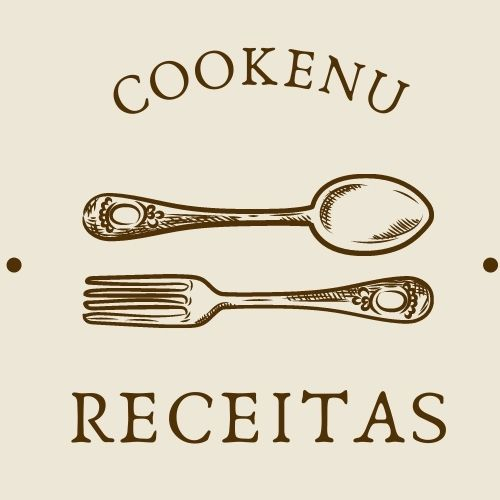
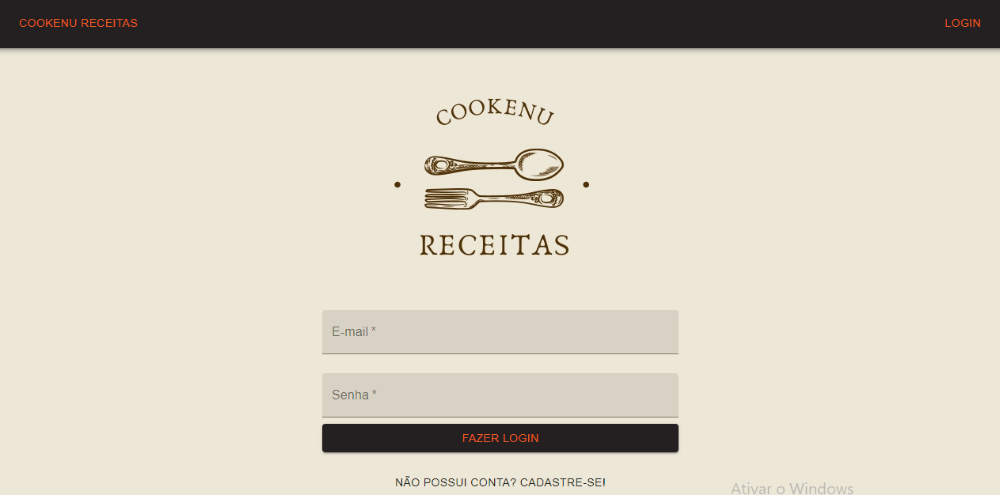
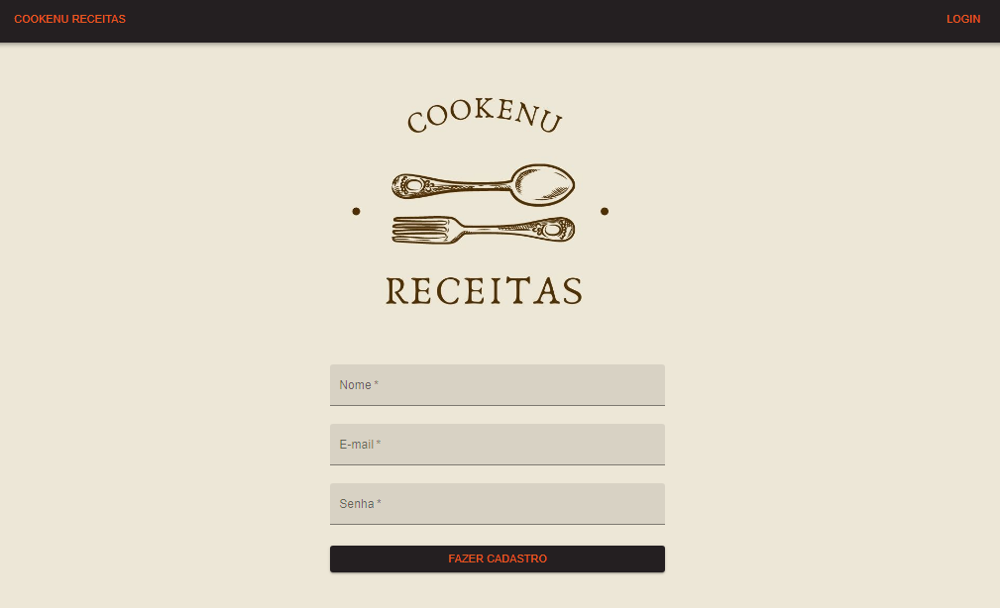
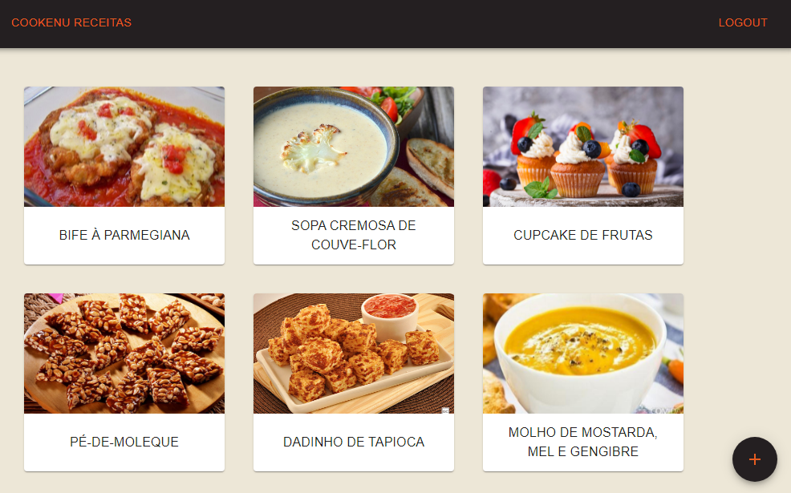

<h1 align="">
   :bento: Cookenu Receitas
</h1>

<h1 align="center">
    
</h1>

<h3 align="center"> 
A melhor receita é a sua!
</h4>
<h4 align="center">
 O melhor da culinária Brasileira direto em suas mãos.
 </h4>

---

## :spaghetti: Sobre    

O site <b>Cookenu Receitas</b> é um prato cheio para quem ama receitas práticas, sem perder a sofisticação. É possível consultar os mais variados pratos típicos de diversas regiões do País, trazendo para você, o melhor da culinária Brasileira. 

<b>Faça seu cadastro hoje mesmo e aproveite!</b>


---


##  🧭Status do Projeto

 :white_check_mark: Concluído.

---

##  🎯Objetivo do Projeto


Este é um projeto Front-end, desenvolvido através do Consumo da [API Cookenu](https://documenter.getpostman.com/view/9133542/U16dQniU), no bootcamp da Labenu, cujos os principais objetivos foram aprofundar diversos fundamentamentos importantes para o desenvolvimento web Front-end, tais como: <b>Consumo de API; Autenticação (Token), Local Storage, Async & Await; useState/useEffect; Hooks/Custom Hooks e React Router.</b>

---


## ☑️Requisitos de Funcionalidade

- :white_check_mark: Cadastrar novos Usuários.
- :white_check_mark: Cadastrar novas Receitas.
- :white_check_mark: Realizar LOGIN
- :white_check_mark: Realizar LOGOUT.
- :white_check_mark: Feed de Receitas.
- :white_check_mark: Detalhe de cada Receita.


---
## :rocket:Tecnologias e Ferramentas utilizadas

- <b>React-JS</b>
- <b>Consumo de API</b>
- <b>Autenticação (Token)</b>
- <b>Local Storage</b>
- <b>Async & Await</b>
- <b>useState/useEffect</b>
- <b>React Router</b>
- <b>Hooks/Custom Hooks</b>
- <b>Styled-components</b>
- <b>Library Material - UI</b>
- <b>Media Query</b>

---

## 💻Demonstração


<h1 align="center">
    
  
  
</h1>

  <h1>
    :iphone: <b>Mobile</b>
  </h1>
  <h1 align="center">
    
  </h1>
 


---

## 🔗Link para Acessar

- **Link do Surge:** https://decorous-dime.surge.sh/

---


## :wrench:Rodando o Projeto

Para Rodar o projeto, siga as seguintes etapas :

  ``` bash
 # Clonar repositório
  
  git clone https://github.com/RenanRodrigues02/Cookenu-Receitas

 # Entre no diretório do projeto
  
  cd Cookenu-Receitas

 # npm install

 # npm run start

```

## 📝Sobre a Licença

Este projeto esta sobe a licença [MIT](https://github.com/RenanRodrigues02/Cookenu-Receitas/blob/main/LICENSE).

---

 :construction_worker: <h3>Desenvolvido por [Renan Rodrigues](https://www.linkedin.com/in/dev-renan-rodrigues/).</h3>
